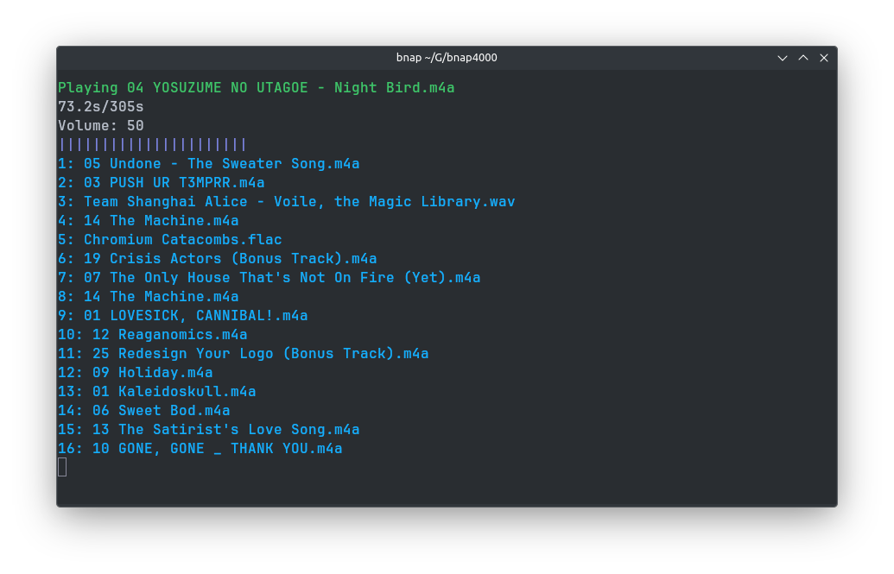

---

# Intro

Badass New Audio Player 4000 (bnap4000) is a simple music player made in made with true randomness in mind. Using libVLC as a backend meaning you don't have to worry about if your music will play, all you need to worry about is getting homework done or working on your project.



# Installation

Assuming you have *nix system (Windows isn't supported), you can run either

## Stable
Download the program from the [releases](https://github.com/0hStormy/bnap4000/releases) tab.

## Unstable

You can run the following:

```
git clone https://github.com/0hStormy/bnap4000.git
cd bnap4000
sh devinstall.sh /usr/local/bin/
```

# Credits

Thank you to the teams of people who made:

* VideoLan for making [libVLC](https://www.videolan.org/vlc/libvlc.html)
* oaubert for making [python-vlc](https://pypi.org/project/python-vlc/)
* tartley for making [Colorama](https://pypi.org/project/colorama/)

Without these projects, I couldn't have made this!