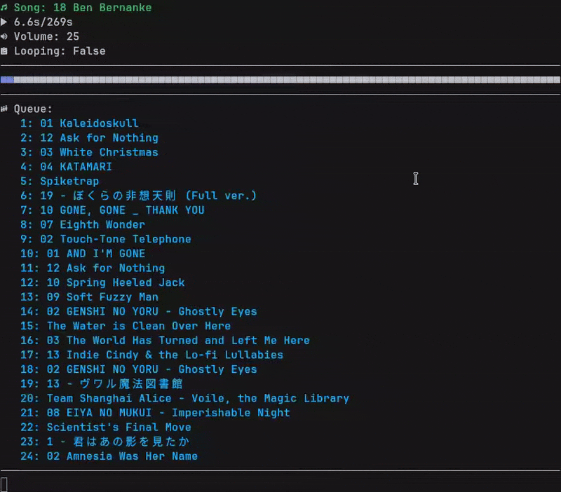

<p align="center">
    
    
    
</p>

---

# Intro

Badass New Audio Player 4000 (bnap4000) is a simple music player made in made with true randomness in mind. Using libVLC as a backend meaning you don't have to worry about if your music will play, all you need to worry about is getting homework done or working on your project.

## Features

* Lightweight
* Runs in your terminal
* Great file compatibility
* Chooses songs randomly
* Single file playback mode
* Cross-platform on Linux and Windows (MacOS too if built yourself)

## Demo



# Installation

Now that you think that this project is pretty cool, let's install the dang thing!

## Stable

1. Make sure you have VLC installed, you can get it from https://www.videolan.org/vlc/ or through your package manager such as `apt` or `winget`
2. Download the program from the [releases](https://github.com/0hStormy/bnap4000/releases) tab.
3. If you want fancy icons in bnap4000, make sure to install and use a Nerd Font of your choice.

    If you're on Linux make sure to install VLC as a system package so bnap4000 can access libraries!

* Linux has the highest support level since it's what I develop on
* Windows has moderate support since I have a virtual machine ready for development
* MacOS has no official support currently but if you can get it to work, good on you!

## Unstable

Make sure you have VLC installed, you can get it from https://www.videolan.org/vlc/ or through your package manager such as `apt` or `winget`. Also make sure you have [Python](https://python.org) with `pip` installed.
If you want fancy icons in bnap4000, make sure to install and use a Nerd Font of your choice.

**You'll need Python 3.11 or newer!**

Install dependencies:

Fedora/RedHat
``` bash
sudo dnf install pip3 python3 python3-devel gcc patchelf ccache git vlc -y
```

Debian/Ubuntu
``` bash
sudo apt install python3-pip python3 python3-dev gcc patchelf ccache git vlc -y
```

Then run the following on *nix:

```
git clone https://github.com/0hStormy/bnap4000.git
cd bnap4000
pip3 install -r requirements.txt # pip command may differ between distro and OS.
sh devinstall.sh /usr/local/bin/
```

For Windows:

```
git clone https://github.com/0hStormy/bnap4000.git
cd bnap4000
pip install -r requirements.txt
py -m nuitka --standalone --onefile main.py # Only runs up to Python 3.12 currently.
```

# Default Keybinds

* `Z` to skip song
* `-` to lower volume
* `=` to make volume higher
* `X` to restart the current song
* `L` to toggle looping
* `Q` to quit

# Credits

Thank you to the teams of people who made:

* VideoLan for making [libVLC](https://www.videolan.org/vlc/libvlc.html)
* oaubert for making [python-vlc](https://pypi.org/project/python-vlc/)
* tartley for making [Colorama](https://pypi.org/project/colorama/)

Without these projects, I couldn't have made this!
